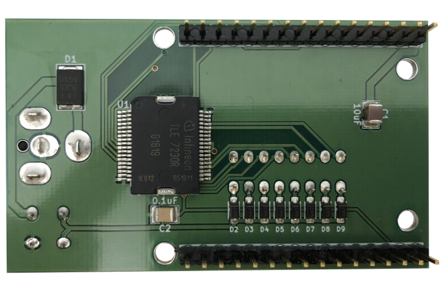

- [Repository Information](#orge525b0b)
  - [Description](#org0bc1c6c)
- [Images](#org26ba3c3)
- [Schematic](#org31a6ed4)
- [Gerbers](#org7ba7e0c)
- [Bill of Materials](#orga80dabd)
  - [PCB Parts](#orgc05bb46)
  - [Supplemental Parts](#org1c6e48d)
  - [Vendor Parts Lists](#org0d3d511)
- [Supplemental Documentation](#org3926df8)
  - [Assembly Instructions](#org50c1561)

# Repository Information

-   **Name:** power\_switch\_controller\_3x2
-   **Version:** 1.1
-   **License:** Open-Source Hardware
-   **URL:** <https://github.com/janelia-kicad/power_switch_controller_3x2>
-   **Author:** Peter Polidoro
-   **Email:** peterpolidoro@gmail.com

## Description

This board controls up to 8 low-side power switches for turning on and off solenoids, relays, and resistive loads.

# Images

# Schematic

[./schematic/power\_switch\_controller\_3x2.pdf](./schematic/power_switch_controller_3x2.pdf)

# Gerbers

Send gerbers zip file to your favorite PCB manufacturer for fabrication.

[./gerbers/power\_switch\_controller\_5x3\_v1.1.zip](./gerbers/power_switch_controller_5x3_v1.1.zip)

# Bill of Materials

## PCB Parts

| Item | Reference(s)               | Quantity | PartNumber     | Vendor  | Description                               |
|---- |-------------------------- |-------- |-------------- |------- |----------------------------------------- |
| 1    | C1                         | 1        | 445-4536-1-ND  | digikey | CAP CER 10UF 50V 10% X7S 1210             |
| 2    | C2                         | 1        | 399-13229-1-ND | digikey | CAP CER 0.1UF 100V X7R 1210               |
| 3    | D1                         | 1        | 568-11697-1-ND | digikey | DIODE SCHOTTKY 45V 10A CFP15              |
| 4    | D2 D3 D4 D5 D6 D7 D8 D9    | 8        | CMHD3595 CT-ND | digikey | DIODE GEN PURP 150V 150MA SOD123          |
| 5    | L1 L2 L3 L4 L5 L6 L7 L8 L9 | 9        | 350-1723-ND    | digikey | LED 2MM 24V VERTICAL RED PC MNT           |
| 6    | MDB1                       | 2        | S1011E-16-ND   | digikey | 16 Position Header Through Hole Male Pins |
| 7    | P1                         | 1        | CP-063BH-ND    | digikey | CONN PWR JACK DC 2.5X5.5 8A T/H           |
| 8    | P2                         | 1        | S9187-ND       | digikey | CONN HEADR 2.54MM 16POS GOLD SMD          |
| 9    | SW1                        | 1        | 360-2610-ND    | digikey | SWITCH SLIDE SPST 0.4VA 28V               |
| 10   | U1                         | 1        | TLE7230RCT-ND  | digikey | IC SW SMART OCTAL LOWSIDE PDSO36          |

## Supplemental Parts

| Item | Quantity | PartNumber   | Vendor  | Description                       |
|---- |-------- |------------ |------- |--------------------------------- |
| 1    | 32       | WM2800-ND    | digikey | CONN HOUSING 2POS .100 SINGLE     |
| 2    | 64       | WM2512-ND    | digikey | CONN TERM FEMALE 22-24AWG GOLD    |
| 3    | 64       | WM2513-ND    | digikey | CONN TERM FEMALE 24-30AWG GOLD    |
| 4    | 4        | AKC16H-ND    | digikey | CONN IDC SKT 16POS W/POL 15 GOLD  |
| 5    | 1        | MC16M-300-ND | digikey | CBL RIBN 16COND 0.050 MULTI 300ft |
| 6    | 4        | APK16B-ND    | digikey | CONN IDC PIN 16POS 30AU NO LATCH  |
| 7    | 32       | WM2900-ND    | digikey | CONN HOUSING 2POS .100 W/LATCH    |
| 8    | 64       | WM2570-ND    | digikey | CONN TERM FEMALE 22-24AWG GOLD    |
| 9    | 64       | WM2572-ND    | digikey | CONN SOCKET 24-30AWG CRIMP 30AU   |
| 10   | 32       | WM2533-ND    | digikey | CONN HOUSING MALE 2POS .100       |
| 11   | 64       | WM2566-ND    | digikey | CONN PIN 24-30AWG CRIMP 30GOLD    |
| 12   | 64       | WM2567-ND    | digikey | CONN TERM MALE 22-24AWG GOLD      |

## Vendor Parts Lists

[./bom/digikey\_parts.csv](./bom/digikey_parts.csv)

[./bom/supplemental\_digikey\_parts.csv](./bom/supplemental_digikey_parts.csv)

# Supplemental Documentation

## Assembly Instructions

-   Solder header pins into the driver board, making note of TOP label. Insert header pins on bottom of board so that the long unsoldered header pins point down when the TOP label faces up.
-   Solder surface mount and through hole components onto the pcb.
